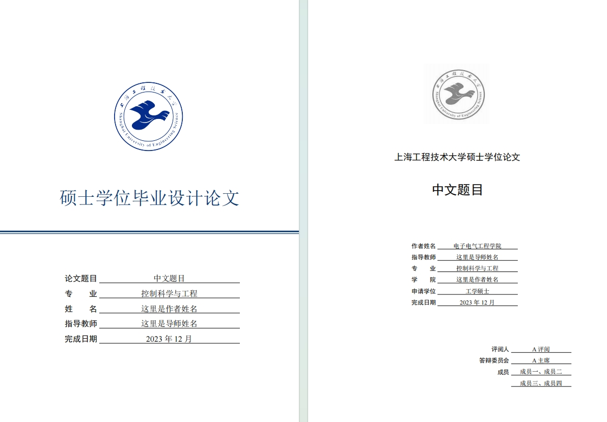
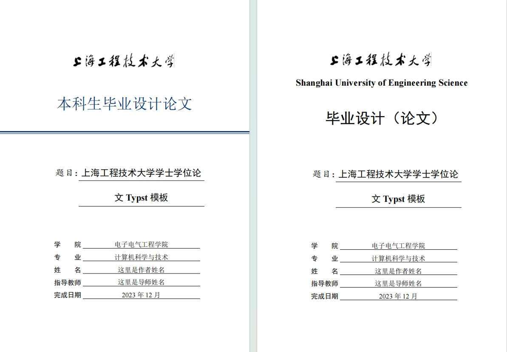

# 上海工程技术大学学位论文Typst模板

第一次接触Typst源于一次LaTeX社区推荐，突然发现一个非常好的项目，即Typst，这个项目是用Rust写的一个轻量级项目。
相对于LaTeX，Typst较为轻量级、编译速度快，而且语法比较简单，适合于文档开发的操作。

## Windows/Linux/MacOS/FreeBSD使用方法

参考[Typst项目页面](https://github.com/typst/typst)的安装方式进行安装。

硕士学位论文为`master.typ`，学士学位论文为`bachelor.typ`，开箱即用。

## 编译预览
<table>
  <tr>
    <td></td>
    <td></td>
  </tr>
</table>

## 参考项目

1. [北京大学博士学位论文Typst模板](https://github.com/lucifer1004/pkuthss-typst)
2. [中山大学本科学位论文Typst模板](https://github.com/howardlau1999/sysu-thesis-typst)

## 开源协议

本项目遵循MIT License协议。

